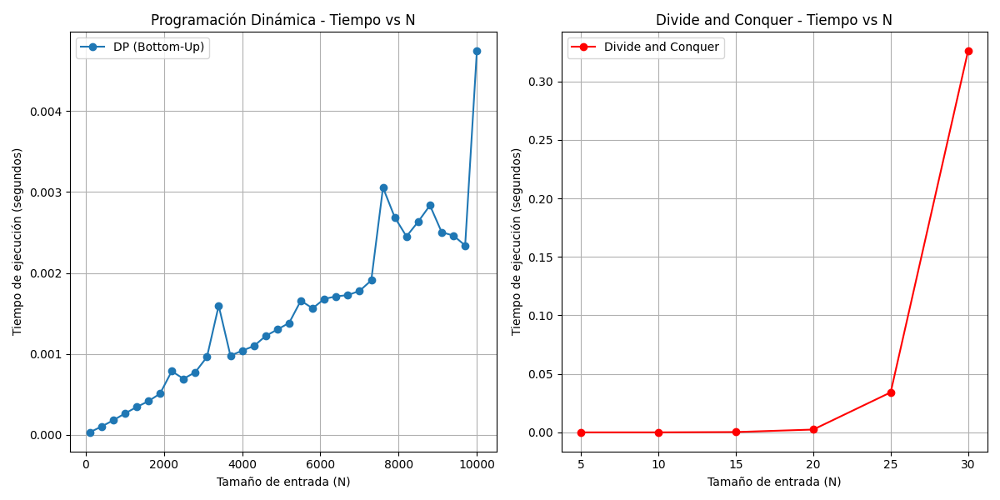

# 📊 Análisis Empírico del Problema "Frog Jump"

## Introducción

El presente documento detalla el análisis empírico realizado sobre el problema "Frog Jump", utilizando dos enfoques de resolución: **Divide and Conquer (DaC)** y **Programación Dinámica (PD)**, específicamente con enfoque **bottom-up (tabulación)**.

El objetivo es comparar el desempeño práctico de ambos algoritmos a través de:

- La medición de tiempos de ejecución sobre entradas aleatorias.
- El análisis gráfico del comportamiento temporal.
- La validación empírica del análisis teórico realizado previamente.

## 📖 Recordatorio del Problema

Una rana se encuentra en el primer escalón de una escalera con alturas dadas por un arreglo `heights[]`, y desea alcanzar el último escalón. Puede saltar 1 o 2 escalones, y cada salto consume una cantidad de energía igual a la diferencia absoluta de alturas:

$\text{Energía} = |\text{height}[i] - \text{height}[j]|$

Se desea **minimizar** la energía total consumida desde el primer al último escalón.

## Análisis Teórico de Complejidad

### Divide and Conquer (sin memorización)

El algoritmo DaC divide el problema en dos llamadas recursivas:

$E(n) = \min\left( E(n-1) + |h_n - h_{n-1}|,\; E(n-2) + |h_n - h_{n-2}| \right)$

Cada llamada genera dos nuevas llamadas, formando un árbol de recursión similar a Fibonacci. Su complejidad es:

$T(n) = T(n-1) + T(n-2) + O(1) \Rightarrow O(2^n)$

### Programación Dinámica (Bottom-Up)

En la versión PD, se evita la recursión calculando los resultados de manera iterativa desde la base:

$\text{dp}[i] = \min\left(\text{dp}[i-1] + |h_i - h_{i-1}|,\; \text{dp}[i-2] + |h_i - h_{i-2}|\right)$

El algoritmo recorre el arreglo una vez y usa constantes auxiliares `prev1` y `prev2`, logrando:

- **Complejidad temporal:** $O(n)$
- **Complejidad espacial:** $O(1)$

## Código del Análisis Empírico

Se implementó el siguiente código en Python para:

- Generar entradas aleatorias.
- Medir los tiempos de ejecución de ambos algoritmos.
- Graficar los resultados.

```python
import random
import time
import matplotlib.pyplot as plt

# Divide and Conquer (recursivo puro)
def minEnergyFrogJumpDaC(heights, n):
    if n == 0:
        return 0
    if n == 1:
        return abs(heights[1] - heights[0])
    return min(
        minEnergyFrogJumpDaC(heights, n-1) + abs(heights[n] - heights[n-1]),
        minEnergyFrogJumpDaC(heights, n-2) + abs(heights[n] - heights[n-2])
    )

# Programación Dinámica Bottom-Up
def minEnergyFrogJumpDP(heights):
    n = len(heights)
    if n == 1:
        return 0
    prev2 = 0
    prev1 = abs(heights[1] - heights[0])
    for i in range(2, n):
        current = min(
            prev1 + abs(heights[i] - heights[i - 1]),
            prev2 + abs(heights[i] - heights[i - 2])
        )
        prev2 = prev1
        prev1 = current
    return prev1

# Tamanos de prueba
sizes_dac = list(range(5, 35, 5))
sizes_dp = list(range(100, 10001, 300))

# Almacenamiento de tiempos
times_dac = []
times_dp = []

# Medición para DaC
for size in sizes_dac:
    heights = [random.randint(0, 10000) for _ in range(size)]
    start = time.perf_counter()
    minEnergyFrogJumpDaC(heights, len(heights) - 1)
    end = time.perf_counter()
    times_dac.append(end - start)

# Medición para PD
for size in sizes_dp:
    heights = [random.randint(0, 10000) for _ in range(size)]
    start = time.perf_counter()
    minEnergyFrogJumpDP(heights)
    end = time.perf_counter()
    times_dp.append(end - start)

# Graficar
plt.figure(figsize=(12, 6))

# PD
plt.subplot(1, 2, 1)
plt.plot(sizes_dp, times_dp, marker='o', label='DP (Bottom-Up)')
plt.title('Programación Dinámica - Tiempo vs N')
plt.xlabel('Tamaño de entrada (N)')
plt.ylabel('Tiempo de ejecución (segundos)')
plt.grid(True)
plt.legend()

# DaC
plt.subplot(1, 2, 2)
plt.plot(sizes_dac, times_dac, marker='o', color='red', label='Divide and Conquer')
plt.title('Divide and Conquer - Tiempo vs N')
plt.xlabel('Tamaño de entrada (N)')
plt.ylabel('Tiempo de ejecución (segundos)')
plt.grid(True)
plt.legend()

plt.tight_layout()
plt.show()
```

## Resultados Empíricos

### ▶ Programación Dinámica (Bottom-Up)

- El tiempo de ejecución crece de forma **lineal** con respecto al tamaño de entrada `N`.
- Incluso para `N = 10,000`, el tiempo sigue siendo < 0.003 segundos.
- Esto confirma empíricamente la complejidad teórica $O(n)$.

### ▶ Divide and Conquer (Puro)

- El tiempo de ejecución se incrementa **exponencialmente** a partir de `N = 20`.
- A `N = 30`, el tiempo supera los **0.25 segundos**.
- Esto valida la complejidad $O(2^n)$.

## Comparación y Conclusiones



| Enfoque            | Complejidad | Escalabilidad | Tiempo (N=10,000)                 |
| ------------------ | ----------- | ------------- | --------------------------------- |
| Divide and Conquer | $O(2^n)$  | Mala          | Inviable (se detiene antes de 50) |
| PD (Bottom-Up)     | $O(n)$    | Excelente     | \~0.0027s                         |

- El enfoque **Programación Dinámica** es claramente superior para casos grandes.
- **DaC** es útil para enseñar recursión, pero **no es práctico** para entradas grandes sin memorización.
- La comparación empírica **respalda perfectamente** lo demostrado en el análisis teórico.

## Recomendaciones

- Para escalabilidad, siempre se debe preferir **PD bottom-up**.
- En caso de querer usar DaC, se recomienda agregar **memoización** (PD top-down).
- El análisis empírico es clave para validar lo que se deduce de manera teórica, y debe integrarse siempre en proyectos algorítmicos.
