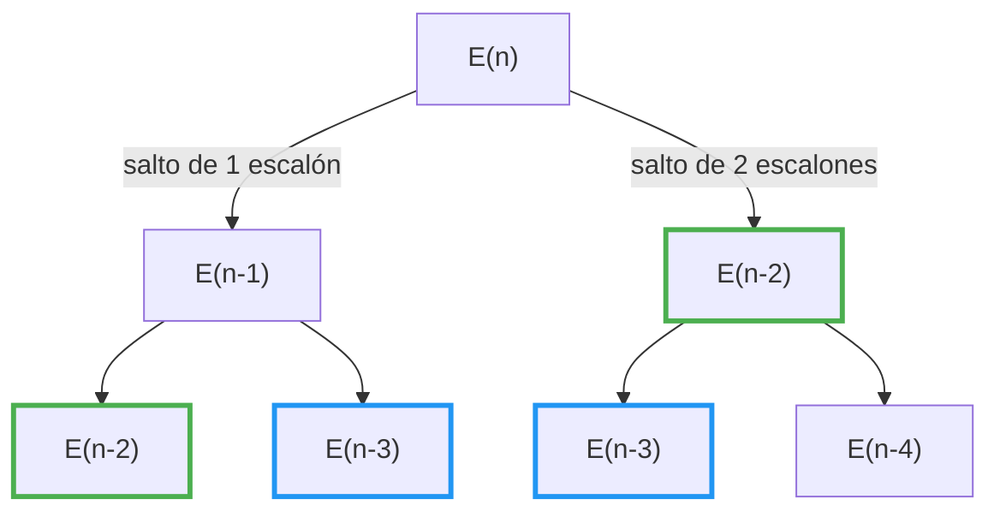

# Frog Jump Problem – Demostración Condiciones para Programación Dinámica 🐸

Se deben cumplir dos condiciones:

- **Subestructura Óptima**
- **Subproblemas Traslapados**

## 📌 1. Demostración de Subestructura Óptima

### **Resumen del problema**

Dada una escalera con alturas definidas en un arreglo **`heights[]`**, la rana puede saltar 1 o 2 escalones adelante. La energía consumida para cada salto es:

$$
\text{energía} = |heights[i] - heights[j]|
$$

donde $i$ es el escalón inicial y $j$ es el escalón destino.

Queremos encontrar la energía total mínima desde el escalón inicial (1) al final (N).

### **Pasos para demostrar Subestructura Óptima**

- **Identificar decisiones clave**:
  - En cada escalón, la rana debe decidir si salta 1 o 2 escalones adelante.

- **Identificar subproblemas**:
  - El problema principal (**energía mínima hasta N**) puede dividirse en:
    - Energía mínima para llegar al escalón anterior (`N-1`).
    - Energía mínima para llegar dos escalones atrás (`N-2`).

- **Plantear la ecuación recursiva** (formulación matemática):

Sea $E(n)$ la energía mínima para alcanzar el escalón $n$:

$$
E(n) = \begin{cases}
0, & n = 1 \quad(\text{primer escalón, no consume energía inicial}) \\
|heights[2]-heights[1]|, & n=2 \\
\min\{ E(n-1) + |heights[n]-heights[n-1]|,\quad E(n-2) + |heights[n]-heights[n-2]| \}, & n>2
\end{cases}
$$

Esta ecuación indica que la solución óptima para el escalón `n` depende exclusivamente de las soluciones óptimas de los subproblemas `n-1` y `n-2`.

### **Demostración por Reducción al Absurdo**

#### Queremos demostrar

> La solución óptima para alcanzar el escalón $N$, denotada como $E(N)$, **debe estar compuesta por soluciones óptimas** de los subproblemas $E(N-1)$ o $E(N-2)$.

#### Supongamos lo contrario (hipótesis falsa)

> Existe una solución óptima $E(N)$ que **no utiliza las soluciones óptimas** de $E(N-1)$ ni $E(N-2)$, sino caminos subóptimos para llegar a esos escalones.

#### Entonces

- Supongamos que el camino usado por $E(N)$ llega desde $N-1$, pero la energía usada para llegar a $N-1$ **no es mínima**.
- Es decir, existe una mejor forma (más eficiente) de llegar a $N-1$; llamémosla $E'(N-1)$, tal que:

$$
E'(N-1) < E(N-1)
$$

- La energía total de $E(N)$, usando este nuevo camino, sería:

$$
E_{\text{nuevo}}(N) = E'(N-1) + |heights[N] - heights[N-1]|
$$

#### Comparación

Ya que $E'(N-1) < E(N-1)$, entonces:

$$
E_{\text{nuevo}}(N) < E(N-1) + |heights[N] - heights[N-1]| = E(N)
$$

#### Contradicción

Esto implica que hemos encontrado una forma **más barata** de llegar al escalón $N$, es decir:

$$
E_{\text{nuevo}}(N) < E(N)
$$

Pero esto **contradice** la suposición inicial de que $E(N)$ era la solución **óptima**.

#### Conclusión

La hipótesis es falsa.  
Por lo tanto, **la solución óptima $E(N)$ necesariamente utiliza soluciones óptimas a los subproblemas** $E(N-1)$ o $E(N-2)$.

**Se cumple la propiedad de subestructura óptima.**

## 📌 2. Demostración de Subproblemas Traslapados

Un problema tiene subproblemas traslapados si se calcula repetidamente la misma solución varias veces durante el proceso recursivo.



### **Pasos para demostrar Subproblemas Traslapados**

- Si se analiza nuevamente la ecuación recursiva:

$$
E(n) = \min\{ E(n-1) + |heights[n]-heights[n-1]|,\quad E(n-2) + |heights[n]-heights[n-2]| \}
$$

- Al intentar resolver esto de manera recursiva sin memorización, observamos que muchos valores se calculan repetidamente:

Por ejemplo, para `E(5)`:

```plaintext
E(5)
├── E(4)
│   ├── E(3)
│   │   ├── E(2)
│   │   │   └── E(1)
│   │   └── E(1)
│   └── E(2)  <- Calculado nuevamente (subproblema traslapado)
│       └── E(1)
└── E(3)      <- Calculado nuevamente (subproblema traslapado)
    ├── E(2)
    │   └── E(1)
    └── E(1)
```

Podemos notar claramente cómo subproblemas (por ejemplo, `E(3)`, `E(2)`) se repiten múltiples veces.

**Conclusión:**  
Debido a esta repetición de subproblemas, este problema claramente satisface la condición de **subproblemas traslapados**, lo que justifica el uso de programación dinámica para evitar estos cálculos redundantes.

## 🛠️ Solución

Dado que se han demostrado claramente las propiedades necesarias para aplicar programación dinámica, elegiremos el enfoque **Bottom-Up (Tabulación)** debido a su eficiencia en tiempo y memoria.

Implementaremos la solución usando Python.

### **Código en Python (Bottom-Up)**

```python
def minEnergyFrogJump(heights):
    n = len(heights)
    if n == 1:
        return 0  # No consume energía si solo hay un escalón.

    # Caso base para los primeros dos escalones:
    prev2 = 0
    prev1 = abs(heights[1] - heights[0])

    # Calcular iterativamente la energía mínima para cada escalón:
    for i in range(2, n):
        current = min(
            prev1 + abs(heights[i] - heights[i - 1]),
            prev2 + abs(heights[i] - heights[i - 2])
        )
        prev2 = prev1
        prev1 = current

    return prev1

# Ejemplo de uso:
if __name__ == "__main__":
    heights = [10, 20, 30, 10]
    resultado = minEnergyFrogJump(heights)
    print(f"Energía mínima: {resultado}")
```

**Salida del ejemplo:**

```markdown
Energía mínima: 20
```
