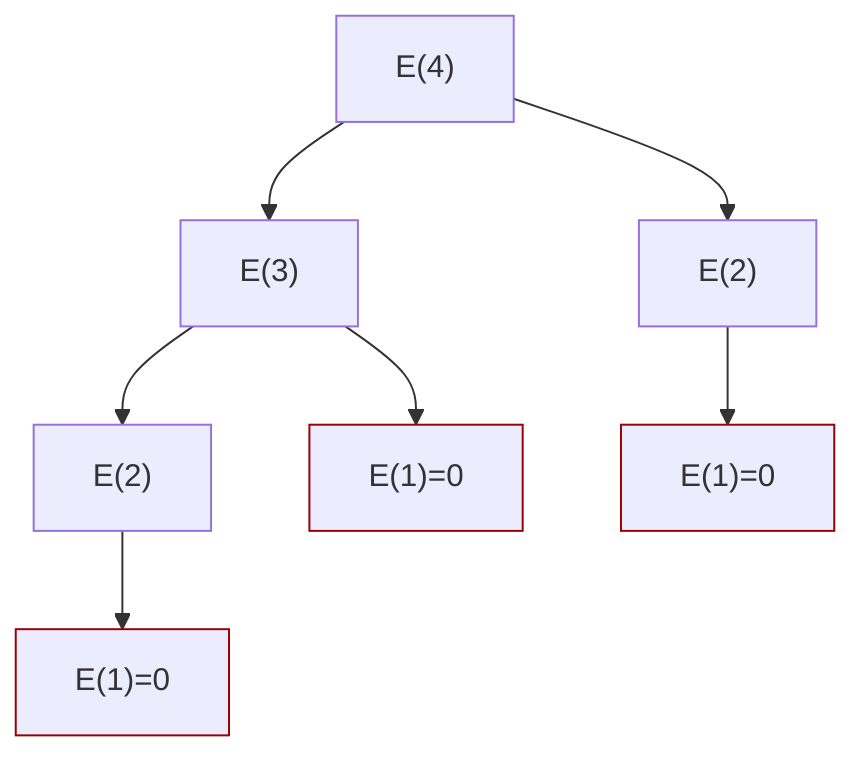

# Frog Jump Problem – Demostración DaC 🐸

## 📌 1. Divide (Dividir el problema)

Dividimos claramente el problema principal en subproblemas más pequeños e independientes.

- El problema principal es encontrar la **energía mínima** para llegar del escalón `1` al escalón `N`.
- Podemos dividirlo en dos subproblemas más pequeños:

  - Encontrar la energía mínima para llegar al escalón `N-1`.
  - Encontrar la energía mínima para llegar al escalón `N-2`.

## 📌 2. Conquer (Resolver los subproblemas)

Cada subproblema se resuelve independientemente utilizando el mismo enfoque recursivo:

- Se aplica la misma lógica hasta alcanzar los casos base:
  
  **Casos Base:**
  - $E(1) = 0$, pues la rana inicia aquí.
  - $E(2) = |heights[2]-heights[1]|$.

  **Caso General (n > 2):**
  - $E(n) = \min\{E(n-1) + |heights[n]-heights[n-1]|,\, E(n-2) + |heights[n]-heights[n-2]|\}$

Cada subproblema ($E(n-1)$ y $E(n-2)$) se resuelve aplicando recursivamente esta ecuación.

## 📌 3. Combine (Combinar soluciones de subproblemas)

La solución al problema principal (**energía mínima hasta `N`**) se construye combinando las soluciones de los subproblemas:

$$
E(N) = \min\{E(N-1) + |heights[N]-heights[N-1]|,\, E(N-2) + |heights[N]-heights[N-2]|\}
$$

Al tener las soluciones óptimas para ambos subproblemas, simplemente escoges la opción que te dé la menor energía acumulada.

## 📌 Análisis del algoritmo DaC (Ecuación de Recurrencia)

Planteamos la ecuación de recurrencia para analizar el algoritmo DaC descrito:

Sea $T(n)$ el tiempo que tarda en resolverse el problema con tamaño $n$:

$$
T(n) = T(n - 1) + T(n - 2) + O(1)
$$

- La razón es que resolvemos recursivamente dos subproblemas ($n-1$ y $n-2$) en cada paso, y luego combinamos las soluciones en tiempo constante $O(1)$.

### **Resolución mediante Árbol de Recursión**

Dibujando el árbol de recursión se observa:

```plaintext
T(n)
├─ T(n-1)
│  ├─ T(n-2)
│  │  ├─ T(n-3)
│  │  └─ T(n-4)
│  └─ T(n-3)
│     ├─ T(n-4)
│     └─ T(n-5)
└─ T(n-2)
   ├─ T(n-3)
   └─ T(n-4)
```



Podemos observar que el árbol es muy similar al árbol de recurrencia del problema de Fibonacci. Esto implica que el crecimiento del tiempo es exponencial.  

Específicamente, la recurrencia coincide con la sucesión de Fibonacci, cuya solución conocida es exponencial:

$$
T(n) = O(2^n)
$$

### **Resolución mediante Método de Sustitución (inducción matemática)**

Para verificar formalmente la solución mediante inducción matemática (método de sustitución):

- **Hipótesis**: $T(n) \leq c \cdot 2^n$ para alguna constante $c > 0$.

Reemplazamos en la recurrencia:

$$
T(n) = T(n-1) + T(n-2) + O(1) \leq c \cdot 2^{n-1} + c \cdot 2^{n-2} + O(1)
$$

Simplificamos la expresión:

$$
T(n) \leq c \cdot 2^{n-2}(2 + 1) + O(1) = \frac{3c}{4} \cdot 2^n + O(1)
$$

Para satisfacer la condición inicial $T(n) \leq c \cdot 2^n$, se escoge un valor suficientemente grande de $c$, por lo que la solución queda confirmada como:

$$
T(n) = O(2^n)
$$

### **Resolución usando el Método Maestro**

La recurrencia no es de la forma exacta requerida por el método maestro clásico, por lo que este método no se aplica directamente a esta ecuación específica debido a que la recurrencia no se expresa en términos de una división constante del tamaño del problema (por ejemplo, $n/2$, $n/3$, etc.).

> **Nota:**  
> El método maestro clásico se usa para recurrencias del tipo:
> $$
> T(n) = aT\left(\frac{n}{b}\right) + f(n)
> $$
> En nuestro caso la recurrencia es diferente, por lo que la solución adecuada es por árbol de recursión o por sustitución.

## 🛠️ Solución

### **Implementación en Python (Recursiva Pura)**

```python
def minEnergyFrogJumpDaC(heights, n):
    # Caso base: primer escalón
    if n == 0:
        return 0
    # Caso base: segundo escalón
    if n == 1:
        return abs(heights[1] - heights[0])

    # Resolver recursivamente para escalones anteriores
    return min(
        minEnergyFrogJumpDaC(heights, n-1) + abs(heights[n] - heights[n-1]),
        minEnergyFrogJumpDaC(heights, n-2) + abs(heights[n] - heights[n-2])
    )

# Ejemplo de uso:
if __name__ == "__main__":
    heights = [10, 20, 30, 10]
    resultado = minEnergyFrogJumpDaC(heights, len(heights)-1)
    print(f"Energía mínima (DaC puro): {resultado}")
```

**Salida del ejemplo:**

```markdown
Energía mínima (DaC puro): 20
```
