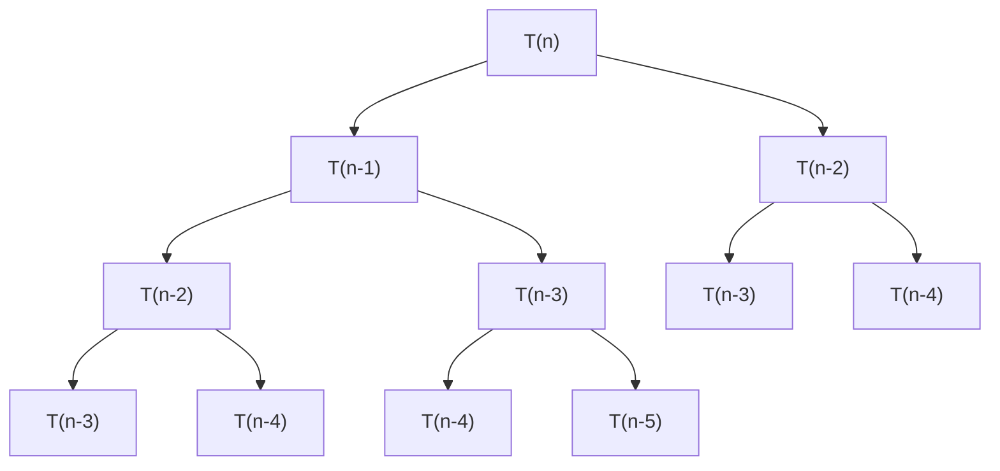
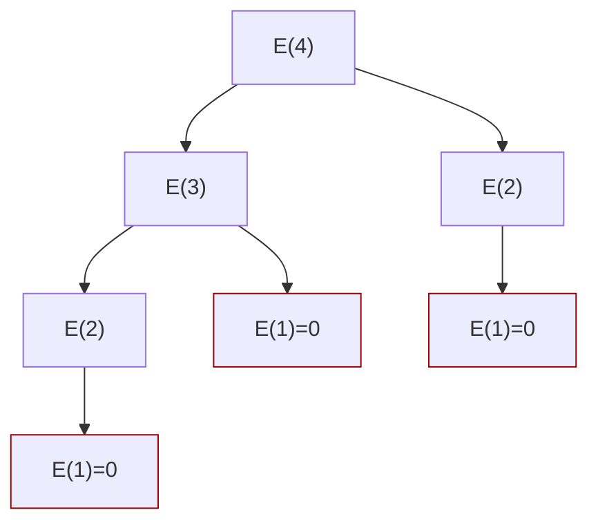

# Frog Jump Problem – Demostración DaC 🐸

## 📌 1. Divide (Dividir el problema)

Dividimos claramente el problema principal en subproblemas más pequeños e independientes.

- El problema principal es encontrar la **energía mínima** para llegar del escalón `1` al escalón `N`.
- Podemos dividirlo en dos subproblemas más pequeños:

  - Encontrar la energía mínima para llegar al escalón `N-1`.
  - Encontrar la energía mínima para llegar al escalón `N-2`.

## 📌 2. Conquer (Resolver los subproblemas)

Cada subproblema se resuelve independientemente utilizando el mismo enfoque recursivo:

- Se aplica la misma lógica hasta alcanzar los casos base:
  
  **Casos Base:**
  - $E(1) = 0$, pues la rana inicia aquí.
  - $E(2) = |heights[2]-heights[1]|$.

  **Caso General (n > 2):**
  - $E(n) = \min\{E(n-1) + |heights[n]-heights[n-1]|,\, E(n-2) + |heights[n]-heights[n-2]|\}$

Cada subproblema ($E(n-1)$ y $E(n-2)$) se resuelve aplicando recursivamente esta ecuación.

## 📌 3. Combine (Combinar soluciones de subproblemas)

La solución al problema principal (**energía mínima hasta `N`**) se construye combinando las soluciones de los subproblemas:

$$
E(N) = \min\{E(N-1) + |heights[N]-heights[N-1]|,\, E(N-2) + |heights[N]-heights[N-2]|\}
$$

Al tener las soluciones óptimas para ambos subproblemas, simplemente escoges la opción que te dé la menor energía acumulada.

## 📌 Análisis del algoritmo DaC (Ecuación de Recurrencia)

Sea $T(n)$ el tiempo que tarda en resolverse el problema con tamaño $n$:

$$
T(n) = T(n - 1) + T(n - 2) + O(1)
$$

- La razón es que resolvemos recursivamente dos subproblemas ($n-1$ y $n-2$) en cada paso, y luego combinamos las soluciones en tiempo constante $O(1)$.

### **Resolución mediante Árbol de Recursión**

Dibujando el árbol de recursión se observa:



#### **Paso 1 - Determinar la Altura del Árbol:**

El árbol no crece de manera **proporcional**, ya que la rama **izquierda** resta $n-1$ al tamaño y la **derecha** $n-2$.  
Si tomamos el **camino más largo** (la rama izquierda), podemos determinar que **para el peor de los casos** el árbol tendrá aproximadamente **$O(n)$ niveles**, porque en cada iteración se resta **1** hasta llegar a $n = 1$. Utilizando un ejemplo para 4 escalones:



Por lo tanto, la altura del árbol es aproximadamente:

$$
O(n)
$$

#### **Paso 2 - Determinar la Cantidad de Nodos en Cada Nivel:**

Como el algoritmo **siempre divide en dos subproblemas**, el número de nodos en cada nivel es $2^k$:

| Iteración | Cantidad de Nodos | Explicación |
|-----------|------------------|-------------|
| 1         | $1$          | Nodo raíz $n$ |
| 2         | $2$          | $n-1$ y $n-2$ |
| 3         | $4$          | Cada $n-1$ y $n-2$ generan dos nodos |
| 4         | $8$          | Cada nodo del paso anterior se divide |
| 5         | $16$         | Sigue la misma lógica |

{height=150px}

El número de nodos en el **último nivel** es aproximadamente:

$$
2^n
$$

#### **Paso 3 - Determinar la Complejidad Temporal por Nivel:**

El **costo en cada nodo** es $O(1)$ porque solo realiza **una suma**.

Ya que en cada nivel hay $2^k$ nodos y cada nodo tiene costo $O(1)$, el costo total por nivel es:

- **Nivel 0**: $O(1)$ (1 nodo)
- **Nivel 1**: $O(2)$ (2 nodos)
- **Nivel 2**: $O(4)$ (4 nodos)
- **Nivel k**: $O(2^k)$ ($2^k$ nodos)

Como la **altura del árbol es $O(n)$**, en el último nivel $k = n$ y por lo tanto hay $O(2^n)$ nodos, por lo que la **complejidad total** del árbol es:

$$
T(n) = O(2^n)
$$

Esto debido a que k depende de la cantidad de la altura del árbol para estimar la cantidad de nodos al final del árbol, por lo tanto $k=n$.

### **Resolución mediante Método de Sustitución (inducción matemática)**

De manera formal:

$$
T(n) =
\begin{cases}
O(1), & \text{si } n \leq 1 \\
T(n-1) + T(n-2) + O(1), & \text{si } n > 1
\end{cases}
$$

#### **Paso 1 - Planteamiento de la hipótesis**\newline

Aquí tienes el **método de sustitución corregido y adaptado específicamente al problema del Frog Jump**, manteniendo la claridad y formalidad:

## Método de Sustitución – Frog Jump Problem

Queremos encontrar un límite superior para la función de recurrencia del algoritmo recursivo:

$$
T(n) = T(n-1) + T(n-2) + O(1)
$$

Esta representa el tiempo necesario para calcular la energía mínima hasta el escalón $n$ considerando dos saltos posibles: desde $n-1$ y $n-2$.

### **Paso 1 - Hipótesis inductiva**

Supongamos que existe una constante $c > 0$ tal que:

$$
T(k) \leq c \cdot 2^k \quad \text{para todo } k < n
$$

Queremos demostrar que también se cumple para $n$.

### **Paso 2 - Sustitución en la ecuación de recurrencia**

Partimos de:

$$
T(n) = T(n-1) + T(n-2) + O(1)
$$

Aplicando la hipótesis inductiva a $T(n-1)$ y $T(n-2)$:

$$
T(n) \leq c \cdot 2^{n-1} + c \cdot 2^{n-2} + d \quad \text{para alguna constante } d
$$

Factorizando $c$:

$$
T(n) \leq c \left(2^{n-1} + 2^{n-2}\right) + d
$$

Usando propiedades de potencias:

$$
2^{n-1} + 2^{n-2} = 2^{n-2}(2 + 1) = 3 \cdot 2^{n-2}
$$

Entonces:

$$
T(n) \leq c \cdot 3 \cdot 2^{n-2} + d
$$

Queremos probar que:

$$
T(n) \leq c \cdot 2^n
$$

Sabemos que:

$$
3 \cdot 2^{n-2} = \frac{3}{4} \cdot 2^n
$$

Entonces:

$$
T(n) \leq \frac{3}{4} c \cdot 2^n + d
$$

Si elegimos $c$ lo suficientemente grande para absorber $d$, existe una constante $c'$ tal que:

$$
T(n) \leq c' \cdot 2^n
$$

Por lo tanto, se mantiene la hipótesis.

### **Paso 3 - Verificación del caso base**

Para $n = 0$ y $n = 1$, se define:

- $T(0) = 0$
- $T(1) = |heights[1] - heights[0]| = O(1)$

Y según la hipótesis:

$$
T(0) \leq c \cdot 2^0 = c \\
T(1) \leq c \cdot 2^1 = 2c
$$

Esto es válido para $c \geq 1$.

### **Conclusión**

Como:

- Se cumple la desigualdad para el caso base.
- Se mantiene para $n$ si se cumple para $k < n$.

Entonces, por **inducción**, la recurrencia:

$$
T(n) = T(n-1) + T(n-2) + O(1)
$$

tiene solución asintótica:

$$
T(n) = O(2^n)
$$

### **Resolución usando el Método Maestro**

La recurrencia no es de la forma exacta requerida por el método maestro clásico, por lo que este método no se aplica directamente a esta ecuación específica debido a que la recurrencia no se expresa en términos de una división constante del tamaño del problema (por ejemplo, $n/2$, $n/3$, etc.).

> **Nota:**  
> El método maestro clásico se usa para recurrencias del tipo:
> $$
> T(n) = aT\left(\frac{n}{b}\right) + f(n)
> $$
> En nuestro caso la recurrencia es diferente, por lo que la solución adecuada es por árbol de recursión o por sustitución.

## 🛠️ Solución

### **Implementación en Python (Recursiva Pura)**

```python
def minEnergyFrogJumpDaC(heights, n):
    # Caso base: primer escalón
    if n == 0:
        return 0
    # Caso base: segundo escalón
    if n == 1:
        return abs(heights[1] - heights[0])

    # Resolver recursivamente para escalones anteriores
    return min(
        minEnergyFrogJumpDaC(heights, n-1) + abs(heights[n] - heights[n-1]),
        minEnergyFrogJumpDaC(heights, n-2) + abs(heights[n] - heights[n-2])
    )

# Ejemplo de uso:
if __name__ == "__main__":
    heights = [10, 20, 30, 10]
    resultado = minEnergyFrogJumpDaC(heights, len(heights)-1)
    print(f"Energía mínima (DaC puro): {resultado}")
```

**Salida del ejemplo:**

```markdown
Energía mínima (DaC puro): 20
```
